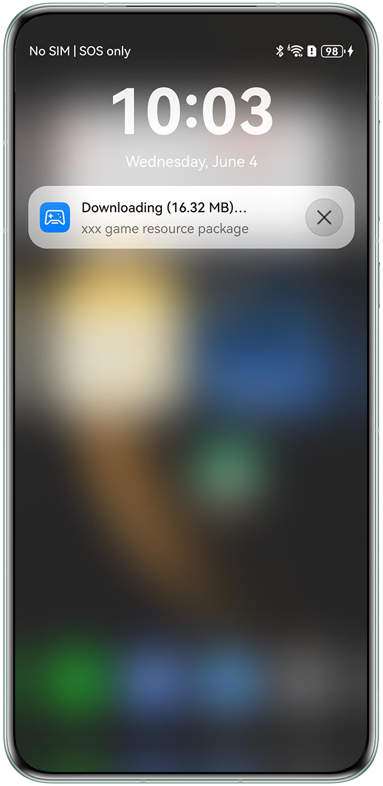
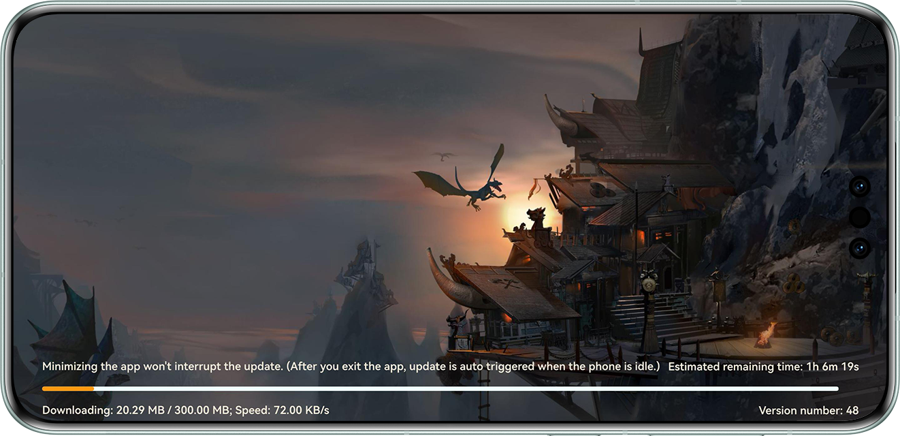

# Resource Package Background Download

## Overview

This sample demonstrates how to download game resources (such as level packages, 3D character models, and textures) to user devices through the functions of system background download, app foreground download, download switch from system background to app foreground, or download switch from app foreground to app background. This addresses the problem of slow game startup, providing users with an instant play experience.

## Preview

|             **Notification panel**            |                 **App home screen**                 |
|:------------------------------:|:----------------------------------------:|
|  |  |

Operation description:

1. On the home screen of a mobile phone, tap **ResDownload** to start the app.
2. Wait for game resource detection. If some game resources need to be updated, the app starts game resource download.
3. Wait for the resource download to complete. Alternatively, exit the app to pause the download.

## Project Directory

```
└──entry/src/main                                   // Code area.
    ├──ets
    │    ├──common
    │    │    ├──AssetAccelManifest.ets             // Resource acceleration list processing class.
    │    │    └──CommonConstants.ets                // Constant definition class.
    │    ├──entryability 
    │    │    └──EntryAbility.ets                   // Entry point class.
    │    ├──extensionability 
    │    │    └──AssetAccelExtAbility.ets           // Resource acceleration extension capability class.
    │    ├──pages 
    │    │    └──Index.ets                          // App home screen.
    │    ├──session 
    │    │    └──AssetSessionStorage.ets            // Storage class.
    │    └──task
    │         ├──GameStepBase.ets                   // Game resource base class.
    │         ├──GameStepDetect.ets                 // Game resource detection class.
    │         └──GameStepDownload.ets               // Game resource download class.
    ├──resources                                    // Directory of resource files.
    └──module.json5                                 // Module configuration file.
```

## Instructions
1. Use DevEco Studio to open the project directory.
2. Replace **bundleName** in the **app.json5** file in **AppScope** with the actual value.
3. Configure the signing information in **signingConfigs** of **build-profile.json5**.
4. Run the sample code on a HarmonyOS NEXT device. For more details, please refer to [Graphics Accelerate Kit](https://developer.huawei.com/consumer/en/doc/harmonyos-guides/graphics-accelerate-kit-guide).

## Required Permissions

Add the network permission **ohos.permission.INTERNET** and the continuous task permission **ohos.permission.KEEP_BACKGROUND_RUNNING** to the **module.json5** file.


## Constraints

1. This sample app is only supported on Huawei phones and tablets with standard systems.
2. The HarmonyOS version must be HarmonyOS 5.1.0 Release or later.
3. The DevEco Studio version must be DevEco Studio 6.1.0 Release or later.
4. The HarmonyOS SDK version must be HarmonyOS 6.1.0 Release SDK or later.
